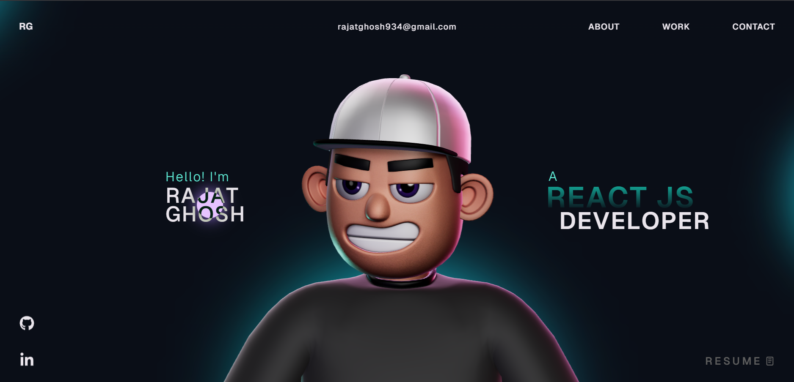

# 🌐 My Portfolio Website

Welcome to the open-source version of my personal portfolio! 🚀  
This project is a reflection of my skills, creativity, and passion for modern web development.

🔗 **Live Preview:**(https://my-portfolio-rg-eosin.vercel.app/)  
*(Feel free to explore and get inspired!)*

---

## ✨ About This Project

This portfolio is not just a website — it's an interactive experience.  
Built with modern technologies and smooth animations, it showcases my projects, skills, and development journey in a visually engaging way.

---

## ⚡ Features

- 🎨 Clean and modern UI/UX  
- 🌀 Smooth animations powered by GSAP  
- 🌌 Interactive 3D elements using Three.js & WebGL  
- 📱 Fully responsive across all devices  
- 🚀 Optimized for performance  

---

## 🛠️ Tech Stack

- ⚛️ React  
- 📘 TypeScript  
- 🎞️ GSAP  
- 🌐 Three.js  
- 🧪 WebGL  
- 🎨 HTML5 & CSS3  
- 🧠 JavaScript  

---

## ⚠️ Important Note

This project uses **GSAP Club plugins (trial version)**.  
Please note:

🔴 Trial plugins are **not allowed for production/hosting**

To use official plugins, get access here:  
👉 https://gsap.com/docs/v3/Installation/

---

## 📸 Preview

---

## 🤝 Contributing

Feel free to fork this repository, explore the code, and suggest improvements!  
If you like it, don’t forget to ⭐ the repo 😉

---

## 📜 License

This project is open-source and available under the **MIT License**.

---

💬 *Let’s connect and build something amazing together!*
